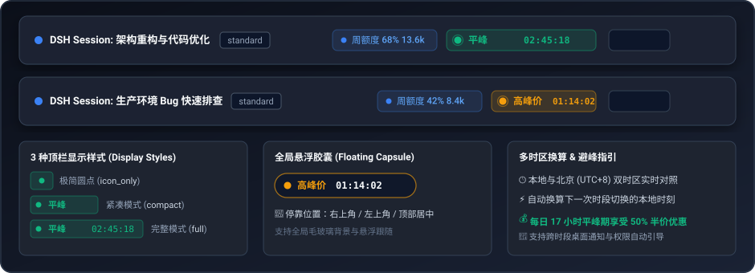
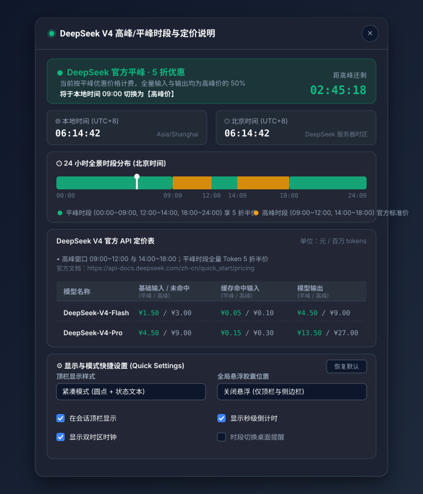

# dsh-peak-indicator (DeepSeek Peak / Off-Peak Time Indicator)

English | [中文 (Chinese)](./README.zh-CN.md)

**DeepSeek Peak / Off-Peak Time Indicator for DSH Web GUI**: Real-time pricing window status chip, live countdown, multi-timezone auto-conversion, 24-hour visual schedule timeline, and official DeepSeek API pricing reference table (V4.1 pricing rules).

---

## 📖 Overview

Following DeepSeek API's dynamic pricing policy effective **September 10, 2026 12:00 (Beijing Time / UTC+8)** and official clarification on **September 19, 2026**:
- **Peak Hours**: Monday to Friday (excluding Chinese statutory holidays) **`09:00~12:00`** and **`14:00~18:00`** (Beijing Time / UTC+8), billed at standard official rates.
- **Off-Peak Hours (50% Half-Price Discount)**: All remaining weekday hours, **all Saturdays and Sundays**, **all Chinese public holidays**, and **weekend make-up workdays** enjoy 50% discount across cache-hit input, cache-miss input, and output tokens.
- **V4 Pro Auto-Routing**: DeepSeek-V4-Pro requests are automatically routed to DeepSeek-V4.1-Flash and billed at V4.1 Flash prices.

**`dsh-peak-indicator`** integrates seamlessly into the DeepSeek Harness (DSH) Web GUI to give developers and teams instantaneous awareness of current pricing windows, countdowns to the next schedule switch, and transparent cost references.

---

## 📸 Visual Previews

### 1. Header Actions Chip & Floating Capsule Styles


### 2. 24-Hour Timeline & Official Pricing Details Modal (with Live Countdown & Quick Settings)
<p align="center">
  
</p>

---

## 🌟 Key Features

1. **Concise & Non-Intrusive Typography**:
   - **English labels**: `Peak Rate` & `Off-Peak`.
   - **Chinese labels**: `高峰价` & `平峰`.
   - Balanced compact width that aligns gracefully with session titles, model selectors, and token quota chips.

2. **Native Session Header Docking (Zero Overlay Conflict)**:
   - Registers via `conversation.session.header.actions` slot at order `35` (immediately adjacent to the quota chip, safely positioned to the left of the Session Log export button).
   - Participates in standard flexbox flow layout with zero element overlap.
   - Optional global floating pill mode (`top-right`, `top-left`, `top-center`).

3. **Accurate DeepSeek Official Schedule Rules (V4.1 & Sep 19 Holiday Update)**:
   - **Peak Windows**: Monday to Friday (excluding Chinese statutory holidays) **`09:00~12:00`** & **`14:00~18:00`** (Beijing Time / UTC+8).
   - **Off-Peak Windows**: Remaining weekday hours, all day Saturday/Sunday, Chinese statutory holidays, and weekend make-up workdays (50% discount).
   - **Focus on V4.1 Core Model**: Pricing table displays `DeepSeek-V4.1-Flash` (V4.1 F); DeepSeek-V4-Pro requests automatically route to V4.1 Flash.

4. **Multi-Timezone Auto-Detection & Dual Clocks**:
   - Automatically detects user browser local timezone and UTC offset.
   - Concurrently displays **Local Time** and **Beijing Time (UTC+8)**, automatically converting schedule switches to the user's local wall clock.

5. **Live Per-Second Countdown & Compact Header Mode**:
   - Header default compact mode displays the status icon and live per-second countdown.
   - Live ticker displaying the remaining duration until the next schedule transition (e.g., `To Peak in 02:28:15` / `To Off-Peak in 01:14:02`).

6. **Interactive 24-Hour Visual Schedule Timeline**:
   - Click the indicator chip to open a details modal.
   - View a full 24-hour visual bar with color-coded segments (🟢 Green for Off-Peak, 🟠 Orange for Peak) and a real-time cursor showing current progress through the day.
   - Hover over segments or the cursor pin for precise time ranges.

7. **Native DSH Internationalization (i18n)**:
   - Registers dictionary via `ctx.locale` (`dsh-peak-indicator`).
   - Automatically follows DSH system language preferences with live hot-switching support.

8. **Sidebar Footer Quick-Access Action**:
   - Mounts a status dot at the right edge of the sidebar footer (`sidebar.footer.action`, order `1000`) without disturbing existing action buttons.

---

## 📊 DeepSeek Official API Pricing Reference (V4.1)

| Model | Base Input (Miss)<br>*(Off-Peak / Peak)* | Cache Hit Input<br>*(Off-Peak / Peak)* | Model Output<br>*(Off-Peak / Peak)* |
| :--- | :---: | :---: | :---: |
| **DeepSeek-V4.1-Flash (V4.1 F)** | **¥1.00** / ¥2.00 | **¥0.02** / ¥0.04 | **¥4.00** / ¥8.00 |

*Notes:*
1. *DeepSeek-V4-Pro is automatically routed to DeepSeek-V4.1-Flash and billed at V4.1 Flash rates.*
2. *Prices in CNY (¥) per 1 Million Tokens.*

---

## 🚀 Installation & Profile Configuration

### 1. In `~/.dsh/profiles/web/package.json`
Add the dependency:
```json
{
  "dependencies": {
    "dsh-peak-indicator": "link:/path/to/dsh-peak-indicator"
  },
  "dsh": {
    "profile": {
      "bundles": [
        "@deepseek-ai/dsh-base",
        "@deepseek-ai/dsh-web-app",
        "dsh-peak-indicator"
      ]
    }
  }
}
```

### 2. Auto-Mounting via `cordis.patch.yml`
The plugin provides its own bundle patch declaration, which is automatically merged into the profile roster upon launch.

---

## 📄 License

MIT License.
